# RethinkDNS HTTPS Inspection Architecture Map

This artifact defines the architectural blueprint and packet flow tracing for integrating local **HTTPS MITM Inspection** into RethinkDNS. It incorporates critical feedback regarding `setHttpProxy` limitations, HTTP/2 ALPN, and response compression.

> **Implementation status (2026-09-09):** CA, LocalHttpsProxy, FilterEngine,
> routing integration, unified Plus UI, N4E eligibility/runtime policy, N9
> per-app hot apply and UDP/443 transport enforcement, plus N10 local-proxy
> firewall parity are canonical on `phase1d-advanced-filter` at
> `63bc8593df3efa83b51f68146b1216f4320f8e44`. Local HTTPS CONNECT and plain
> HTTP requests now consult the existing `BraveVPNService.firewall()` authority
> before DNS/upstream work; direct upstream connections are checked again with
> the resolved destination IP before socket protection/connect. Blocked proxy
> decisions are persisted through the existing Network Logs pipeline. N10A,
> N10B, and N10C passed focused JVM, GHA, and physical-device gates. Direct
> RULE20 device execution remains deferred because no available natural control
> fixture emitted qualifying UDP/443. Functional closure does not waive the
> separate DECISION-011 release blocker for four bundled preset assets whose
> provenance/redistribution gate is unresolved.

---

## 1. Packet Flow Routing (Normal vs. Inspected)

In a non-root environment, we leverage Android's `VpnService.Builder` capability to declare a system-wide HTTP proxy that routes HTTP and HTTPS connections directly to our local proxy server. Un-inspected traffic (UDP, non-HTTP/HTTPS TCP, or traffic from apps explicitly bypassed) continues to route via the Go-based `firestack` tunnel interface.

UDP continues through the firestack path. For UDP destination port 443, the
ordinary firewall result is evaluated first. If that result is allowed and an
active HTTPS policy snapshot says the connection is MITM-eligible,
`InspectionTransportPolicy` returns the dedicated `RULE20` stall result so the
application may retry over TCP. BYPASS decisions, non-UDP traffic, non-443 UDP,
and pre-existing firewall blocks retain their ordinary result.

### Packet Flow Diagram — Overall Architecture

```mermaid
graph TD
    classDef main fill:#e3f2fd,stroke:#1565c0,stroke-width:2px;
    classDef go fill:#efebe9,stroke:#4e342e,stroke-width:2px;
    classDef kotlin fill:#efe8f5,stroke:#4527a0,stroke-width:2px;
    classDef external fill:#fff3e0,stroke:#ef6c00,stroke-width:2px;

    App["Android Application<br/>(e.g., Google Chrome)"]:::external
    VpnBuilder["VpnService.Builder<br/>(BraveVPNService.kt)"]:::kotlin
    LocalProxy["LocalHttpsProxy<br/>(Port 8443)"]:::kotlin
    GoBackend["Go firestack Backend<br/>(GoVpnAdapter.kt)"]:::go
    FirewallManager["FirewallManager<br/>(Kotlin Firewall logic)"]:::kotlin
    Internet["Upstream WAN<br/>(Real Web Server)"]:::external

    %% Routing
    App -->|TCP Traffic (Port 80/443)| VpnBuilder
    VpnBuilder -->|Via System HTTP Proxy| LocalProxy
    App -->|All Other Traffic / UDP| GoBackend

    subgraph Local MITM Inspection Layer (Kotlin)
        LocalProxy -->|1. Parse CONNECT / TLS Handshake| CA["CertificateAuthority<br/>(Android Keystore)"]:::kotlin
        CA -->|2. Dynamic Leaf Cert| LocalProxy
        LocalProxy -->|3. URL Decryption| Filter["FilterEngine<br/>(AdGuard Lists)"]:::kotlin
        LocalProxy -->|4. Response Decompression & Modification| Cosmetic["CosmeticFilter<br/>(Gzip/Brotli + CSS Injection)"]:::kotlin
    end

    LocalProxy -->|Socket connection via direct physical link<br/>(Bypasses Go VPN adapter loop)*| Internet
    GoBackend -->|Consults rules| FirewallManager
    GoBackend -->|Routes non-HTTP/HTTPS to WAN| Internet

    class CA,Filter,Cosmetic,LocalProxy kotlin;
    class GoBackend go;
    class App,Internet external;
```

> [!NOTE]
> **\*Routing Path Clarification**:
> In Android, the VPN app itself is excluded from its own VPN interface (using `addDisallowedApplication(packageName)`) to prevent infinite routing loops.
> Therefore, the socket from `LocalHttpsProxy` to the real world is established
> directly via the underlying active network interface (WiFi/Cellular) and does
> not re-enter the Go `firestack` packet path. N10 closes the former policy gap:
> the proxy resolves the original client UID and explicitly calls the existing
> `BraveVPNService.firewall()` authority before DNS/upstream work, then repeats
> evaluation with the resolved destination IP before protecting or connecting a
> direct upstream socket. This preserves per-app domain/IP/port firewall policy
> without routing the proxy's own socket back through the VPN.

---

### DNS Sinkhole Inheritance Path (Phase-1D-A3 Verified, 2026-08-15)

The following flow is **empirically proven** on Xiaomi Mi A1 (Android 16). Each step is backed by live logcat capture from `phase1d_a3_mitm_full_device_logcat.txt`.

```mermaid
graph TD
    classDef proxy fill:#e3f2fd,stroke:#1565c0,stroke-width:2px;
    classDef dns fill:#e8f5e9,stroke:#2e7d32,stroke-width:2px;
    classDef result fill:#fff3e0,stroke:#ef6c00,stroke-width:2px;

    Browser["Browser / App<br/>(e.g., Chrome, curl)"]:::external
    CONNECT["HTTP CONNECT<br/>doubleclick.net:443"]:::proxy
    Resolve["resolveHostSecurely()<br/>LocalHttpsProxy.kt:L241-248"]:::proxy
    ActiveNet["ConnectivityManager.<br/>activeNetwork.getAllByName()"]:::dns
    RethinkDNS["Rethink DNS Resolver<br/>(VPN DNS Engine)"]:::dns
    Sinkhole["Blocked Domain?<br/>→ 0.0.0.0 SINKHOLE"]:::result
    RealIP["Allowed Domain?<br/>→ Real Public IPs"]:::result
    IpGate["firewall(host, port, resolved IP)<br/>N10 resolved-IP gate"]:::proxy
    Connect["VpnController.protectSocket()<br/>upstream connect"]:::proxy
    Blocked["0.0.0.0:443 → ECONNREFUSED<br/>→ 502 Bad Gateway"]:::result
    Allowed["Real IP:443 → TLS MITM<br/>(whitelisted pkg) / Raw TCP"]:::result

    Browser -->|1. CONNECT request| CONNECT
    CONNECT -->|2. Hostname resolution| Resolve
    Resolve -->|3. Query active VPN network| ActiveNet
    ActiveNet -->|4. Routed to Rethink DNS| RethinkDNS
    RethinkDNS -->|5a. Blocked| Sinkhole
    RethinkDNS -->|5b. Allowed| RealIP
    Sinkhole -->|6a. Resolved destination| IpGate
    RealIP -->|6b. Resolved destination| IpGate
    IpGate -->|7a. Firewall BLOCK| FirewallBlocked["HTTP 403 Forbidden<br/>no protect/connect/MITM"]:::result
    IpGate -->|7b. Firewall ALLOW| Connect
    Connect -->|8a. Sinkhole connection refused| Blocked
    Connect -->|8b. TLS handshake| Allowed
```



**Historical pre-N10 live device evidence (Mi A1 A16, PID 3661):**

| Test | Domain | `resolveHostSecurely()` Result | Outcome | Logcat Trace |
|------|--------|------------------------------|---------|--------------|
| B | `doubleclick.net` | `0.0.0.0` (L28) | HTTP/1.1 502 Bad Gateway | `Resolved host 'doubleclick.net' securely on active network: 0.0.0.0` → `ECONNREFUSED` |
| C | `googleads.g.doubleclick.net` | `0.0.0.0` (L37) | HTTP/1.1 502 Bad Gateway | `Resolved host 'googleads.g.doubleclick.net' securely on active network: 0.0.0.0` → `ECONNREFUSED` |
| D | `example.com` (shell) | `104.20.23.154, 172.66.147.243` (L47) | Raw TCP pass-through 200 OK | `Upstream connection for example.com:443 will route directly via physical interface` → `Bypassing example.com (Raw TCP pass-through mode)` |
| E | `example.com` (Chrome) | `104.20.23.154, 172.66.147.243` (L58) | TLS MITM tunnel established 200 OK | `Established TLS MITM tunnel for example.com` |
| F | `doubleclick.net` (Chrome) | `0.0.0.0` (L69) | ERR_TUNNEL_CONNECTION_FAILED | `Resolved host 'doubleclick.net' securely on active network: 0.0.0.0` → `ECONNREFUSED` |

**Key Architectural Implication**: Domain-level DNS blocking does **NOT** require a manual text-bridge (`syncBlocklistToAdblockRules` → `adblock_rules.txt` → `FilterEngine`) because the underlying OS resolver integration already enforces DNS sinkholing before upstream connect. N10 additionally evaluates ordinary domain policy before DNS and resolved-IP policy after DNS. Cosmetic/scriptlet/element-hiding rules remain the sole domain of `FilterEngine` / `adblock_rules.txt`.

**DECISION-008 (Locked, 2026-08-15)**: Original Rethink DNS policy and Advanced Filter Sources are **independent subsystems**. There is **NO documented source-flow**: `Rethink DNS blocklists → FilterEngine`. The legacy `syncBlocklistToAdblockRules()` is **obsolete pending source cleanup** (A2 STOP-P2). FilterEngine receives rules only from dedicated Advanced Filter Sources (EasyList, AdGuard Base, AdGuard Annoyances, Custom URL).

---

## 2. Technical Mapping & Code Tracing

### A. TUN Interface and Traffic Capture
- **VpnService Entry Point**: [BraveVPNService.kt](file:///L:/test-code/rethink-app/app/src/main/java/com/celzero/bravedns/service/BraveVPNService.kt) manages the life cycle of the Android `VpnService`.
- **Establishment of VPN**: `establishVpn` is called in [BraveVPNService.kt](file:///L:/test-code/rethink-app/app/src/main/java/com/celzero/bravedns/service/BraveVPNService.kt#L3612-L3660) which returns the file descriptor (`tunFd`).
- **L3/L4 Proxying**: The file descriptor is passed to [GoVpnAdapter.kt](file:///L:/test-code/rethink-app/app/src/main/java/com/celzero/bravedns/net/go/GoVpnAdapter.kt#L2882) where `Intra.connect` initializes the Go `firestack` backend.

### A+. InspectionPolicyEngine Boundary (DECISION-010)

`InspectionPolicyEngine` is the **sole authority** for MITM/bypass decisions
before any `CONNECT` tunnel is accepted. No downstream component may bypass its
result.

**Two-stage architecture — policy resolution (pre-MITM) and resource
protection (post-MITM) are separate stages:**

```
PRE-MITM POLICY RESOLUTION
═══════════════════════════

         CONNECTION
              ↓
       app / UID / host / port
              ↓
    InspectionPolicyEngine
       /            \
      ↓              ↓
   BYPASS           MITM
                               ↓
                          TLS interception
                               ↓
                         HTTP response
                               ↓

POST-MITM RESOURCE RESOLUTION
══════════════════════════════

                  ResourceProtectionPolicy
                       /                \
                      ↓                  ↓
                MITM_FULL         MITM_STREAM_ONLY
                      \                /
                       ↓              ↓
                    FilterEngine
            (where applicable)
```

`InspectionPolicyEngine` (and its three sub-policies) resolves BYPASS vs MITM
using only data available before `CONNECT`: package/UID, host, port. It does
not inspect response body size. `ResourceProtectionPolicy` acts only after MITM
is established and the HTTP response is available; it downgrades `MITM_FULL` →
`MITM_STREAM_ONLY` and never produces a BYPASS decision.

Responsibility boundaries (DECISION-010):

| Component | Scope |
|-----------|-------|
| `HttpsInspectionPolicy` | App eligibility: known registry, dynamic discovery, user includes, user exclusions |
| `SystemBypassPolicy` | Internal safety: protected packages, optional UIDs, protected domains, protected (app, port) tuples |
| `ResourceProtectionPolicy` | Post-MITM only: body-size thresholds; downgrades MITM_FULL → MITM_STREAM_ONLY. Never produces BYPASS decisions. |
| `InspectionPolicyEngine` | Pre-MITM orchestrator: resolves precedence, returns (BYPASS | MITM, reason). Must not consult body size. |

**Precedence order:**

1. `SYSTEM_HARD_BYPASS` → `BYPASS_SYSTEM`
2. `USER_APP_EXCLUSION` → `BYPASS_USER`
3. `COMPATIBILITY_EXCLUSION` → `BYPASS_COMPATIBILITY`
4. `PROTECTED_DOMAIN` → `BYPASS_DOMAIN`
   or domain-mode rejection → `BYPASS_DOMAIN_MODE`
5. `PROTECTED_APP_AND_PORT` → `BYPASS_APP_PORT`
6. `KNOWN_BROWSER_INSTALLED` → `MITM_KNOWN_BROWSER`
7. `USER_APP_INCLUDE` → `MITM_USER_APP`
8. `DYNAMIC_BROWSER_DETECTED` → `MITM_DYNAMIC_BROWSER`
9. No match → `BYPASS_DEFAULT`

The compatibility/domain-mode rows reflect canonical runtime behavior already
accepted by N4E; this documentation sync does not introduce new precedence.

`USER_APP_EXCLUSION` remains above all browser eligibility. Therefore known and
dynamic browsers are inspected by default only when they are not explicitly
excluded. Dynamic browsers do not require a separate user-enabled set.

**Key invariants:**
- MITM bypass and FilterEngine rules are independent (DECISION-010 §6). A
  HTTPS-bypassed domain does **not** automatically become a FilterEngine exception rule.
- `InspectionPolicyEngine` runs pre-MITM using only connection metadata
  (app/UID, host, port). It does not inspect response body size.
- `ResourceProtectionPolicy` runs post-MITM. It downgrades `MITM_FULL` →
  `MITM_STREAM_ONLY` based on body size but never produces a BYPASS decision.
- Switching from MITM to raw TCP mid-flow is **prohibited**.
- System hard-bypass entries are internal safety only; they are **not** surfaced
  as ordinary user-editable exclusions.
- Dynamic browser discovery is best-effort: results depend on Android package
  visibility. Known-registry browsers are not affected by an empty discovery result.

### A+1. InspectionTransportPolicy / UDP443 Boundary (N9)

HTTPS eligibility and transport inspectability are separate questions but reuse
the same policy authority.

```text
firestack flow
    ↓
ConnTrackerMetaData
(uid / package / host / port / protocol)
    ↓
ordinary firewall()
    ↓
existing result grounded?
    ├── YES → preserve it
    └── NO
         ↓
inspectionRuntimePolicySnapshot
    ├── null → preserve ordinary result
    └── active
         ↓
InspectionTransportPolicy.evaluate()
    ├── TCP or non-443 UDP → no transport override
    └── UDP/443
          ↓
     InspectionPolicyEngine
       ├── BYPASS → no override
       └── MITM
            ↓
        FirewallRuleset.RULE20
        action = stall
            ↓
        app may retry TCP
            ↓
        system HTTP proxy / LocalHttpsProxy
```

The runtime snapshot is published only after `LocalHttpsProxy` starts and
`VpnService.Builder.setHttpProxy()` succeeds. It is cleared while the HTTPS
runtime is rebuilt and on service destroy/revoke so the packet path cannot use
stale policy.

`RULE20` is lower priority than an already-grounded ordinary firewall result.
It is a dedicated HTTPS Inspection transport result and is not RULE6.

The implementation is package-agnostic. Browser packages and donor preset
QUIC lists
are not hardcoded into this transport layer. The decision remains
`InspectionPolicyEngine.evaluate(...)`.

Targeted transport tests cover known browser, dynamic browser, explicit user
include, user/system/compatibility/domain/default bypass, TCP/443, and
non-443 UDP behavior.

Direct RULE20 device execution is currently verification-deferred because no
available natural fixture emitted a qualifying control UDP/443 flow. This does
not alter the architecture above.

### A+2. Local Proxy Firewall Authority Boundary (N10)

`LocalHttpsProxy` owns socket mechanics, but it does not own a separate
firewall ruleset. N10 routes proxy traffic through the existing
`BraveVPNService.firewall()` decision authority using the original client
socket identity.

```text
HTTPS CONNECT or absolute-URI HTTP request
        ↓
resolve original client UID
        ↓
firewall(host, port, destinationIp="")
        ├── BLOCK → persist blocked connection → HTTP 403 → close
        └── ALLOW
             ↓
       direct upstream selected?
        ├── NO, configured proxy → upstream proxy owns DNS
        └── YES
             ↓
       resolveHostSecurely(host)
             ↓
       firewall(host, port, resolved destinationIp)
        ├── BLOCK → close unconnected socket → persist → HTTP 403
        └── ALLOW
             ↓
       VpnController.protectSocket()
             ↓
       upstream connect
             ↓
       CONNECT 200 / inspection policy / MITM or raw tunnel
```

The first gate is before proxy-side DNS resolution, socket protection,
upstream connect, `HTTP/1.1 200 Connection Established`, request inspection,
or MITM. The second gate applies only when `LocalHttpsProxy` resolves a direct
destination IP; a configured upstream HTTP proxy receives an unresolved
address and remains responsible for DNS.

The evaluator contract is fail-closed: a missing evaluator or ordinary
evaluation exception returns BLOCK, while coroutine cancellation is rethrown.
Both CONNECT and plain HTTP blocks return `HTTP/1.1 403 Forbidden` with a closed
connection.

Blocked metadata is written through the pre-existing `NetLogTracker` path:
`writeRethinkLog()` for the Rethink UID and `writeIpLog()` for other UIDs. N10
does not call `processFirewallRequest()` and does not create a second domain/IP
policy authority.

Physical-device closure proved all three layers:

* N10A: a Chrome-specific `example.com` domain rule blocked before DNS/upstream
  and restored after rule deletion;
* N10B: a Chrome-specific `1.1.1.1` IP rule blocked after resolution but before
  socket protection/connect/MITM and restored after deletion;
* N10C: a Chrome-specific `1.0.0.1:0` IP rule produced a persisted blocked
  Network Logs row (`TCP/443`, reason `IP / Port (App)`) that remained visible
  after the temporary rule was deleted.

### A++. Installed-App Inventory Lifecycle Boundary (N4E)

HTTPS Inspection does not own a second installed-app database.

```text
Android PACKAGE_* lifecycle broadcast
        ↓
BravePackageChangeReceiver
        ↓
RefreshAppsJob
        ↓
package-change refresh action = ACTION_REFRESH_FORCE
        ↓
RefreshDatabase full reconciliation
        ↓
existing AppInfo / FirewallManager inventory
        ↓
HTTPS browser classification overlays that inventory
```

Package lifecycle events are authoritative inventory changes. They bypass the
normal one-minute AUTO/INTERACTIVE refresh throttle so rapid install/remove
bursts cannot leave stale app rows.

Real-device N4E burst evidence removed three controlled fixtures within an
Android package-event window of approximately 3.579 seconds. All three produced
automatic Room deletion and final Configure → Apps exact-search counts of
`0 / 0 / 0`.

---

### B. TCP Connection Injection Point
To avoid interfering with the heavy Cgo-compiled packet capture, we inject a system HTTP/HTTPS proxy.
- **Proxy Configuration**:
  ```kotlin
  val proxyInfo = ProxyInfo.buildDirectProxy("localhost", 8443)
  builder.setHttpProxy(proxyInfo)
  ```
  This is added dynamically in `establishVpn()` inside `BraveVPNService.kt` when `HTTPS_INSPECTION_ENABLED` is `true`.
- **Local Https Proxy Server**:
  A non-blocking `ServerSocket` runs on port `8443` in
  `LocalHttpsProxy.kt` using Coroutines (`Dispatchers.IO`).
- **Connection Pipeline**:
  1. **HTTP CONNECT request** (e.g. `CONNECT google.com:443 HTTP/1.1`) is received on the proxy.
  2. N10 evaluates the original client UID, hostname, and port through the existing firewall authority.
  3. For a direct route, the proxy resolves the host and evaluates the resolved destination IP through the same authority.
  4. Only an allowed flow is protected and connected to the upstream server.
  5. The proxy responds with `HTTP/1.1 200 Connection Established` and evaluates the N4E/N9 HTTPS inspection policy.
  6. For MITM, it generates a leaf certificate for `google.com`, completes downstream and upstream TLS, and parses the decrypted HTTP request.
  7. **FilterEngine** evaluates the request and the response pipeline applies applicable cosmetic/scriptlet/procedural/CSP/HTML processing before returning the response.
  8. For policy BYPASS, the already-authorized connection is piped as raw TCP without FilterEngine execution.

---

## 3. Integration & Guardrails

To ensure that the existing DNS Filtering and Firewall capabilities remain entirely undamaged, we enforce the following strict guardrails:

> [!IMPORTANT]
> **Safety Guardrails**
> - **Opt-In Toggle**: `HTTPS_INSPECTION_ENABLED` must be checked before registering the proxy on `VpnService.Builder`. If disabled (default), the proxy is not registered, and zero proxy overhead is introduced.
> - **No learned handshake bypass**: A TLS failure does not mutate or persist
>   policy and does not switch an already-started connection from MITM to raw TCP
>   mid-flow. Compatibility bypass must be decided before MITM by the policy
>   engine or an explicit exclusion.
> - **DNS Sinkhole Inheritance (PROVEN — Phase-1D-A3)**: The DNS resolution of domains requested in `CONNECT` is performed via `ConnectivityManager.activeNetwork.getAllByName(host)` which routes through the **active VPN network context** — i.e., Rethink's own DNS resolver. Blocked domains automatically receive `0.0.0.0` sinkhole addresses, causing upstream connection failure (`ECONNREFUSED` → `502 Bad Gateway`). **No manual bridge or duplicate blocklist evaluation is required** for domain-level blocking. This mechanism is empirically verified on Mi A1 A16 (2026-08-15).
> - **No blocking operations**: All network operations must run asynchronously using Kotlin Coroutines on `Dispatchers.IO`.

---

## 4. Implementation Status

| Area                                     | Components                                                             | Status at `63bc8593df3efa83b51f68146b1216f4320f8e44`         |
| :--------------------------------------- | :--------------------------------------------------------------------- | :------------------------------------------------------------ |
| Architecture and packet-flow mapping     | This document; DECISION-008; DECISION-010                              | **GOVERNING / CURRENT**                                       |
| Certificate authority                    | `core/ca/CertificateAuthority.kt`                                      | **IMPLEMENTED AND DEVICE-VERIFIED**                           |
| Local MITM proxy                         | `core/proxy/LocalHttpsProxy.kt`                                        | **IMPLEMENTED; N4E + N10 DEVICE-VERIFIED**                    |
| Filter engine and advanced rule handling | `core/filter/FilterEngine.kt` and subtype handlers                     | **IMPLEMENTED**                                               |
| Filter-source pipeline                   | Storage, downloader, compiler diagnostics, atomic activation, rollback | **SEALED THROUGH B4**                                         |
| Filter-source management UI              | Shared Plus UI and Manage Filters surfaces                             | **IMPLEMENTED** for add/edit/remove/enable/disable            |
| HTTPS eligibility and bypass policy      | `InspectionPolicyEngine`, preset snapshot inputs, browser capability discovery | **CANONICAL; N4E/N9 DEVICE-VERIFIED**                         |
| HTTPS transport enforcement              | `InspectionTransportPolicy`, `FirewallRuleset.RULE20`                   | **SOURCE/GHA SEALED; DIRECT DEVICE STIMULUS DEFERRED**         |
| Local-proxy firewall parity               | `LocalProxyFirewallEvaluator`, `BraveVPNService.firewall()`, Network Logs | **CANONICAL; N10A/N10B/N10C DEVICE-VERIFIED**                 |
| End-to-end closure                       | Filter runtime E2E + HTTPS policy + local-proxy firewall matrix         | **CURRENT PHASE-1D ACCEPTANCE SEALED**                        |

The custom-source implementation passed 102/102 targeted JUnit tests and its
add/edit/remove/persistence flows were exercised on the Mi A1. Those UI results
alone did not establish controlled rule blocking; the later D11C2
OFF→ON→OFF runtime-filter gate supplied that separate proof.

Future regressions must still distinguish CA trust, application/domain
eligibility, ordinary firewall policy, resolved-IP policy, upstream TLS,
proxy routing/bypass, filter compilation/activation, and intended rule
blocking. N10 closes the known local-proxy firewall-authority and blocked-log
persistence gaps; it does not close the separate release-level compatibility,
resource-threshold, or RULE20 stimulus work.

---

## 5. Known Limitations & Future Roadmap

During Phase 1, the following critical operational limits and design trade-offs have been identified and incorporated into our roadmap:

### 1. `setHttpProxy` Coverage Limits
- **Behavior**: `setHttpProxy` acts as a system-wide "hint". Apps that use low-level sockets (NDK), hardcoded direct connections, or custom proxy selectors (some versions of OkHttp) will bypass this proxy configuration entirely.
- **Coverage Estimation**: ~60-70% of standard browser traffic and web-views are covered, and ~30-40% of native apps.
- **Future Alternative**: If complete (100%) interception is needed, we must eventually implement TUN-level TCP redirection within the Go `firestack` engine itself to redirect port 80/443 traffic directly to localhost:8443.

### 2. HTTP/2 & ALPN Support
- **Protocol Negotiation**: Standard HTTPS utilizes HTTP/2 extensively via ALPN (Application-Layer Protocol Negotiation).
- **Strategy in Phase 3**: To avoid protocol mismatches, the `LocalHttpsProxy` will handle ALPN negotiation:
  - Upstream TLS handshake will negotiate the best supported protocol (TLSv1.2, TLSv1.3, potentially offering `h2`).
  - To the client (downstream), we can negotiate a downgrade to standard `http/1.1` to maintain straightforward socket-streaming and chunked transfer decoding without requiring a full HTTP/2 multiplexing server in Kotlin.

### 3. Compression Encoding (Gzip/Brotli)
- **Response Modification**: Modern web pages are compressed.
- **Strategy in Phase 3 & 7**: The streaming pipeline in `LocalHttpsProxy.kt` must detect `Content-Encoding: gzip` or `Content-Encoding: br` (Brotli).
  - When modifying `text/html` bodies, the proxy will transparently wrap the stream with a decompression wrapper (e.g., `GZIPInputStream`), inject the CSS snippet before `</head>`, and re-compress (e.g., `GZIPOutputStream`) before forwarding to the client, adjusting the `Content-Length` header accordingly.

### 4. Post-release upstream-maintenance bridge

The fork depends on continuing updates from the original Rethink core. That
maintenance path is the **last project phase**, not part of the current MITM
runtime:

1. finish all authorized MITM/adblock work on `phase1d-advanced-filter`;
2. close source, test, GHA, device, documentation, and release blockers;
3. integrate and push the shipping state to `main`, then complete the intended
   release gate;
4. only then create a separate upstream-maintenance branch and audit/import
   future original-Rethink changes.

The bridge is a Git/source-integration boundary, not a runtime DNS or proxy
bridge. Fork-owned MITM files remain protected, upstream/core-friendly areas
may track original Rethink, and shared files require manual conflict review.
See DECISION-012.
